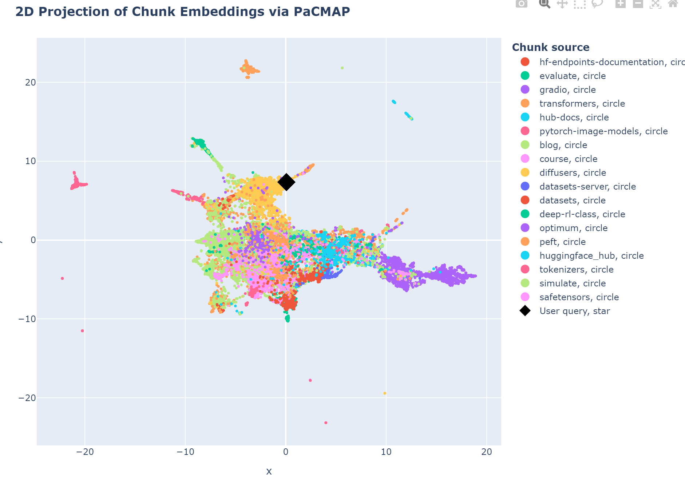
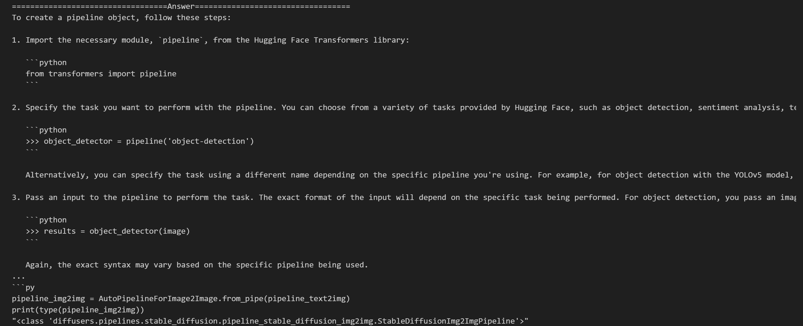
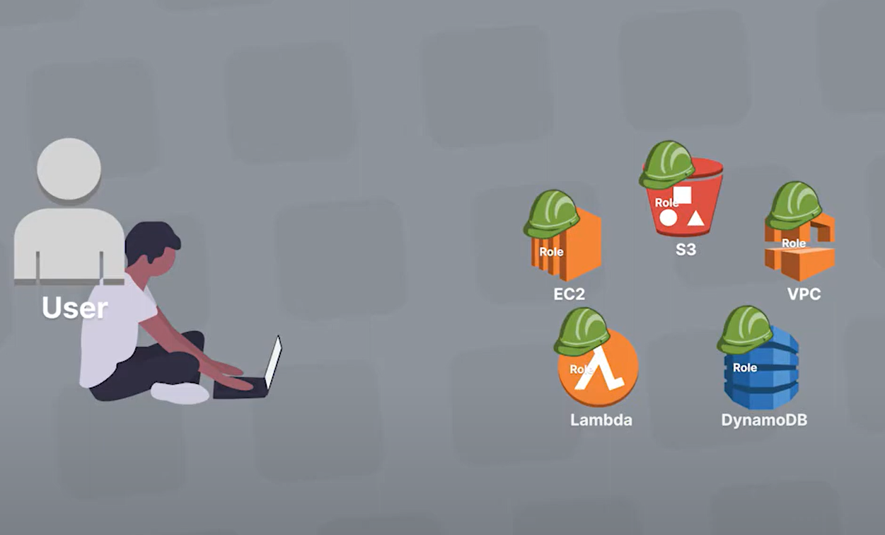
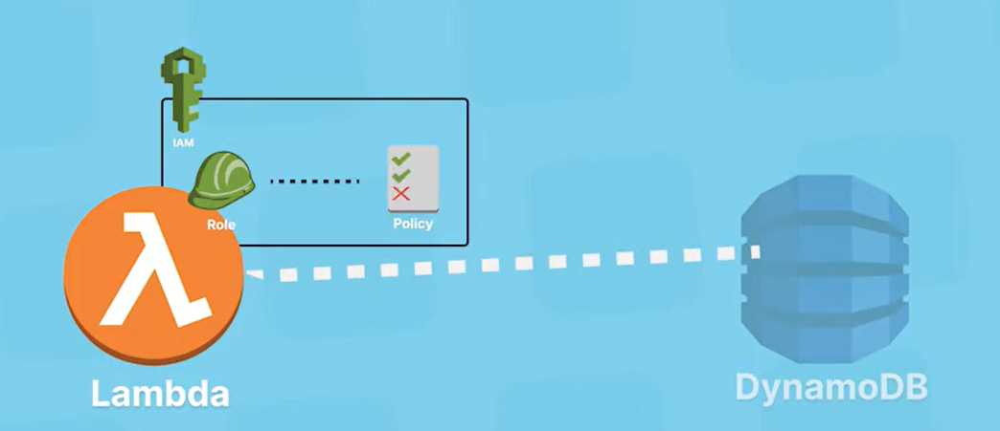
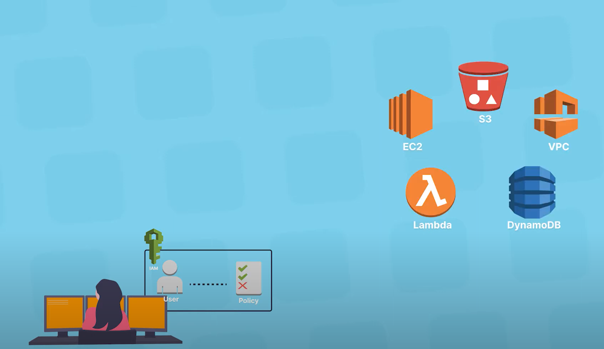
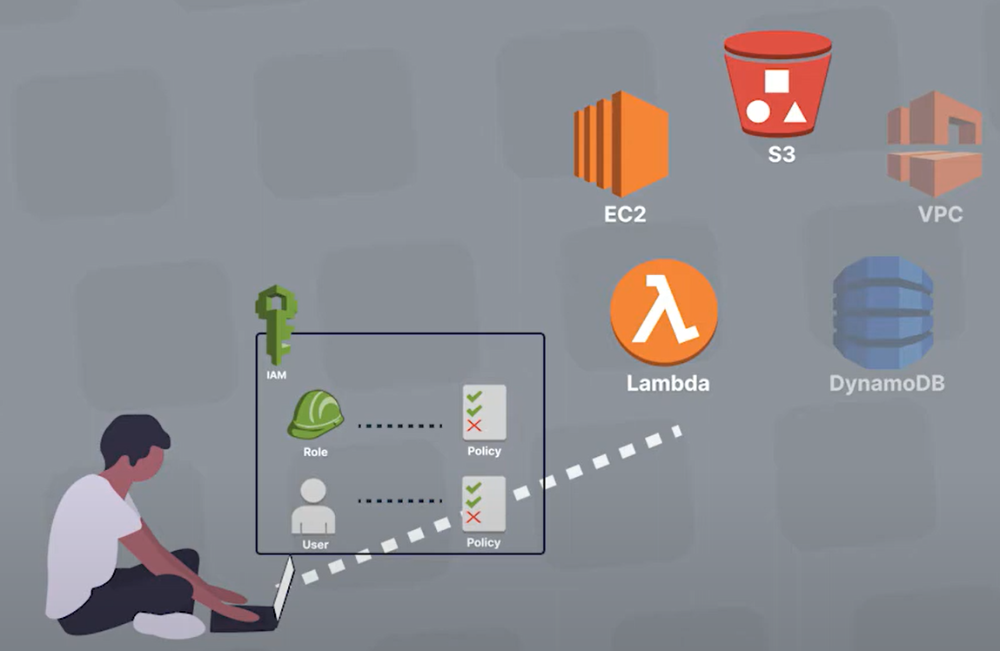
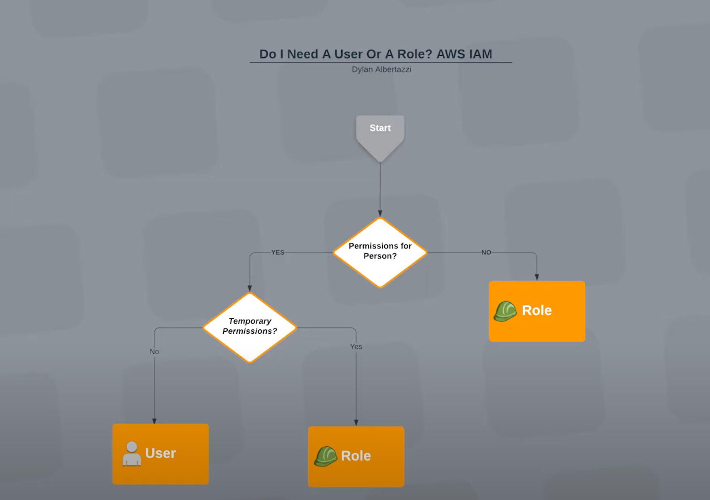

# RAG (Retrieval Augmented Generation)

## 1. Understanding Embeddings

  

### 1.1 How to Do Embeddings (Embedding_hf)
- Embedding with all-MiniLM-L6-v2 (Hugging Face pipeline)

### 1.2 Host Embeddings for Free on the Hugging Face Hub (1_Embedding_hf)

### 1.3 Get the Most Similar Frequently Asked Questions to a Query

## 2. Advanced Embeddings

### 2.1 Word Embeddings with Transformers

### 2.2 Sentence Embeddings

### 2.3 Sentence Transformers
- Using the transformers library
- Using the sentence-transformers library
- Embedding dimensions
- Sequence length

#### DEMO 1: Finding the Most Similar Quora Duplicate

### 2.4 Distance Between Embeddings
- Cosine similarity
- Dot product
- Euclidean distance
- Picking a score function

### 2.5 Scaling Up
In practice, you might have to deal with millions of embeddings, and we cannot always compute the distance to all of them (this is called brute-force search).

#### DEMO 2: Paraphrase Mining

### 2.6 Selecting and Evaluating Models

## 3. Advanced RAG

### 3.1 Retriever - Embeddings

### 3.2 Building the Vector Database
- Nearest neighbor search algorithm
- Distances

### 3.3 Reader Model LLM
The choice of a reader model is important in a few aspects:
- The reader model's `max_seq_length` must accommodate our prompt, which includes the context output by the retriever call: the context consists of 5 documents of 512 tokens each, so we aim for a context length of 4k tokens at least.
- The reader model

#### Prompt
The RAG prompt template below is what we will feed to the Reader LLM: it is important to have it formatted in the Reader LLM's chat template.
We give it our context and the user's question.

#### Reranking
A good option for RAG is to retrieve more documents than you want in the end, then rerank the results with a more powerful retrieval model before keeping only the `top_k`.

#### Demo 3: Functional, performant RAG system

  

# Building a Python API and Fetching it in React: A Step-by-Step Guide
## 0. Prerequisites
- install the Flask 
- install nvm:  https://github.com/nvm-sh/nvm?tab=readme-ov-file#installing-and-updatingnvm
- install npx: https://www.geeksforgeeks.org/installation-of-node-js-on-linux/
- install install Axios libraries: https://www.geeksforgeeks.org/axios-in-react-a-guide-for-beginners/

Introduction to Axios:
Axios, which is a popular library is mainly used to send asynchronous HTTP requests to REST endpoints. This library is very useful to perform CRUD operations.

This popular library is used to communicate with the backend. Axios supports the Promise API, native to JS ES6.
Using Axios we make API requests in our application. Once the request is made we get the data in Return, and then we use this data in our project. 
This library is very popular among developers. You can check on GitHub and you will find 78k stars on it. 

## demo: How to Create a Flask + React Project | Python Backend + React Frontend
https://www.youtube.com/watch?v=7LNl2JlZKHA

# AWS
## 1. Deploying AWS Lambda Functions with Docker and Amazon ECR
- https://www.youtube.com/watch?v=UPkDjhhfVcY

- https://docs.aws.amazon.com/AmazonECR/latest/userguide/what-is-ecr.html

- https://medium.com/@olakunle.abiola/getting-started-with-aws-ecr-797514d7cb4d

## 2. ECR, EC2, Docker Images:

Amazon ECR is a fully-managed, private Docker container registry that makes it easy for developers to store, manage, and deploy Docker container images. Amazon ECR integrates seamlessly with Amazon Elastic Container Service (Amazon ECS) and Amazon Elastic Kubernetes Service (Amazon EKS). Good thing is, Amazon ECR can also be used with other cloud vendors.

## 2.1 ECR VS. EC2
- Functionality:

EC2: Focused on providing raw compute power with virtual servers.
ECR: Focused on managing and storing container images for containerized applications.
- Use Case:

EC2: Used for running a variety of applications, from web servers to databases, by provisioning virtual machines.
ECR: Used specifically for containerized environments, helping manage Docker images that can be deployed to container orchestration services.
- Integration:

EC2: Can run any application that requires a virtual server.
ECR: Typically used in conjunction with AWS container services like ECS, EKS, and AWS Fargate for deploying containerized applications.
- Management:

EC2: Requires users to manage the operating system, patches, scaling, and networking for the instances.
ECR: Manages the storage, security, and versioning of container images, easing the deployment process for containerized applications.

In summary, EC2 is about providing the raw computing infrastructure, whereas ECR is about managing container images for applications running in a containerized environment.

## 2.2 Docker and container:
- container: package apps with all dependencies and configuration
- where do container live: container repo (private/ public) -- docker hub (hub.docker.com)
- why we need container: deploy on different OS/instance might have error
- how container works: package with all needed configuration and download it to local machine (no error) --> no environment on the server - except for docker runtime
- docker vs. VM: docker is better (size, speed) (not a good: compability)
- docker is orginal made for linux based environments

## 2.3 Docker (all you need):
### 2.3.1 Install: Docker Desktop
### 2.3.2 Docker Images vs. Container
- Docker Image: Package everything into an artifact; Can be easily shared and moved; an executable application artifcat; includes app source code and complete environment configuration
- Docker Containers: running instance of an image (can be multiple containers)
### 2.3.3 Docker Registries
- A storage and distribution system for Docker images
- official and unofficial: Docker hub
### 2.3.4 Docker code
- pull a docker: docker pull xxx:ver
- run an image: docker run xx:ver
- check your docker: docker ps
- run in background: docker run -d xxx:ver
### 2.3.5 Port Blinding: 
- Docker run -d -p 9000:80 xx:ver (local host)
- close: docker ps -a/ docker stop id
- restart:' docker start id/name
### 2.3.6: Public and Private Docker
- Private registries: AMZ ECR
- Registry vs. Repository:  Docker Registry: a service providing storage (can be host by 3rd party, e.g., AWS ECR, collection of repositories); Docker REPOSITORY: collection of related images with same name but different versions 

### 2.3.7: Build your own Dockerfile
Docker filer --build --> Docker Image -- run --> Container 
### 2.3.8: Docker UI client

### Demo 1: AWS lambda deploy with ECR, Dockers
https://www.youtube.com/watch?v=UPkDjhhfVcY
#### 0. what is AWS CIL: 
- https://docs.aws.amazon.com/cli/latest/userguide/cli-chap-welcome.html
#### 1. Lamada:
- https://aws.amazon.com/serverless/videos/video-lambda-intro/

Amazon Elastic Container Registry (Amazon ECR) is an AWS managed container image registry service that is secure, scalable, and reliable. 

Python and DockerFile used Github Repo: https://github.com/hitchon1/Lambda_EC...

Below are all the CLI commands used in order to help you follow along.

Commands and Descriptions:

Repository Creation in Amazon ECR
- Command: `aws ecr create-repository --repository-name my-lambda-repo-demo`
- Description: Creates a new repository in Amazon Elastic Container Registry (ECR) with the specified name.

Building a Docker Image
- Command: `docker build -t my-lambda-image .`
- Description: Builds a Docker image using the Dockerfile in the current directory and tags it with the specified name.

Authenticating Docker with Amazon ECR
- Command: `aws ecr get-login-password --region (region) | docker login --username AWS --password-stdin (account id).dkr.ecr.(region).amazonaws.com`
- Description: Retrieves an authentication token from ECR and then uses it to log in to the Docker client.

Fetching AWS Account ID
- Command: `aws sts get-caller-identity --query Account --output text`
- Description: Retrieves the AWS account ID for the authenticated user or role.

Tagging the Docker Image for ECR
- Command: `docker tag my-lambda-image:latest (account id).dkr.ecr.(region).amazonaws.com/my-lambda-repo-demo:latest`
- Description: Tags the previously built Docker image with the ECR repository URL.

Pushing the Docker Image to ECR
-Command: `docker push (account id).dkr.ecr.(region).amazonaws.com/my-lambda-repo-demo:latest`
- Description: Pushes the tagged Docker image to the specified ECR repository.

## 3 IAM roles (identity and access management)
- https://www.youtube.com/watch?v=7sYE6J1_CsQ
- granting s3. ec2. rds 
### 3.1 user vs. role vs. group vs. policy : (demo: give a new person lamada access)
all aws is locked: lamaba, dynamDB, VPC, S3, EC2
- Principle of least privilege
e.g., user -- IAM -- EC2
- IAM Needs 2 Thing: Identity (user, role, group) and Permissions (policy)
- users vs. Role: user is people (e..g, IMA users), role is aws resource 
- group (user group)

  
  
  
   

### 3.2 Demo question: give a temp access to lambda

  

## 4. Monitor your instances using CloudWatch

- aws doc: https://docs.aws.amazon.com/AWSEC2/latest/UserGuide/using-cloudwatch.html
- video: https://www.youtube.com/watch?v=dgAzhQJzPkA
- Github: https://github.com/yeshwanthlm/YouTube/blob/main/memory_utilization_ec2.md
#### demo steps:
- Step 1: Create an IAM and Attach CloudWatch and SSM Full Access - EC2-CloudWatch-Role
- Step 2: Create a parameter in Systems Manger with the name "/alarm/AWS-CWAgentLinConfig" and store the value.
- Step 3: Create an EC2 Instance, Attach the role created in Step 1 and Add the commands in the Userdata Section.

 

